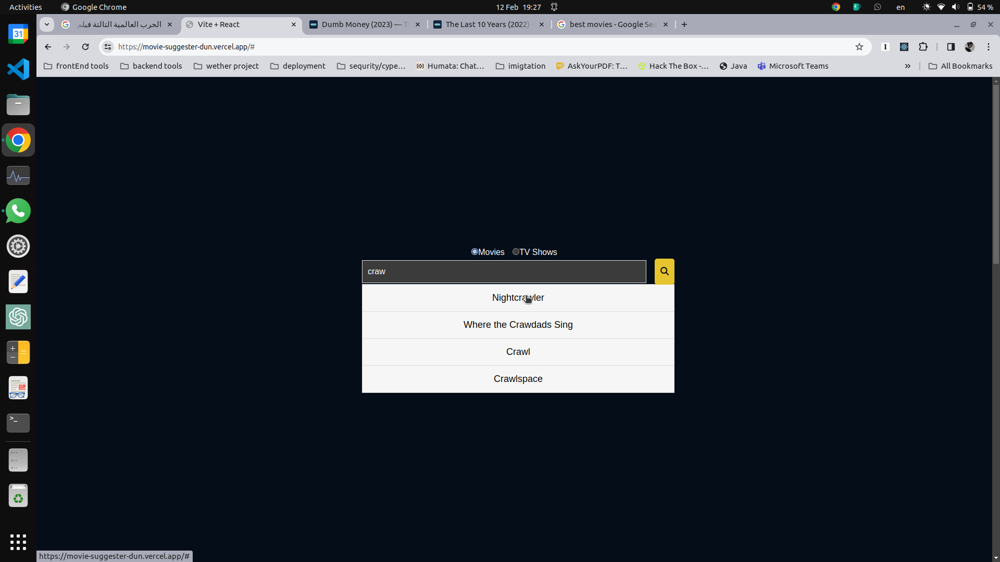
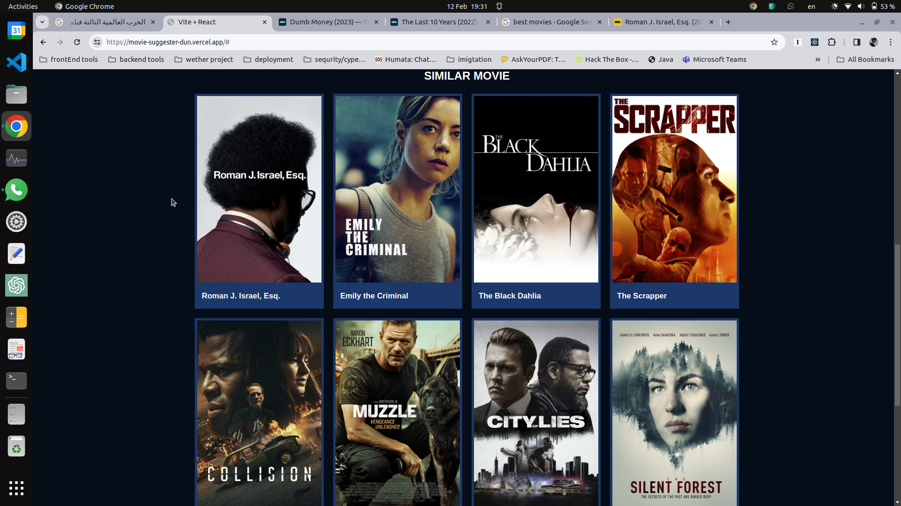

# MtvInsight

[]
[]

## Description
MtvInsight is a movie and TV shows prediction website that leverages a dataset comprising 10k movies and 11k TV shows manually collected from [The Movie Database](https://developer.themoviedb.org/docs/getting-started). The prediction process involves converting each movie or TV show into a vector and determining their similarity based on the direction of these vectors. A small angle between vectors indicates similarity in content.

## Inspiration
I wanted to make a project that i can use and also use machinelearning init

## Quick Start
- [MtvInsight](https://movie-suggester-dun.vercel.app) 

## Usage
- dataset
    option 1: installing manually using [tmdbapi](https://developer.themoviedb.org/docs/getting-started) ==Warning== it takes alot of time to fetch all the data manually.
    code for fetching the movies, tvshow data from 
    code for preparing and processing the similarities in jupiter notebook [movie](), [shows]()

    option 2: you can access the the dataset directly from [tmdb]() dataset a collection of 5k movies
    code for preparing and processing the similarities in jupiter notebook [movie]() [shows]()
- doployment 
>   frontend(react)   --> [vercel](https://vercel.com/)
>   backend(flask)    --> [google-cloud](https://console.cloud.google.com)
>   database(mongodb) --> [atlas](https://www.mongodb.com/atlas/database)

- loading svgs
>   i used the cool library [react-loader-spinner](https://www.npmjs.com/package/react-loader-spinner)

## process

#### first: download the dataset
1. manually (warning takes alot of time)
    - you can see code for fetching the datasets using the code at 
    [fetch_movies](./data_processing/fetch_movie_dataset.py)
    [fetch_tvshows](./data_processing/fetch_tv_dataset.py)
    //note: change (tmdb.api_key) with your actual api key 
    you can get it from [tmdbapi](https://developer.themoviedb.org/docs/getting-started) 
    
2. you can use already existing movies dataset [tmdb dataset](https://www.kaggle.com/datasets/tmdb/tmdb-movie-metadata)
    - note the data neet more processing in the next step

#### second: process and calculate similarity
 - if manually installed the data use this for calculating similarities 
 [movie.ipynp](./data_processing/final_movie.ipynb)
 [show.ipynp](./data_processing/tvshows.ipynb)

 - if manually installed the data use
 [movie_pre.ipynp](./data_processing/old_movie.ipynb)

## stack 
> backend
- flask
> frontend
- react
- vanilla css

## Contributing
